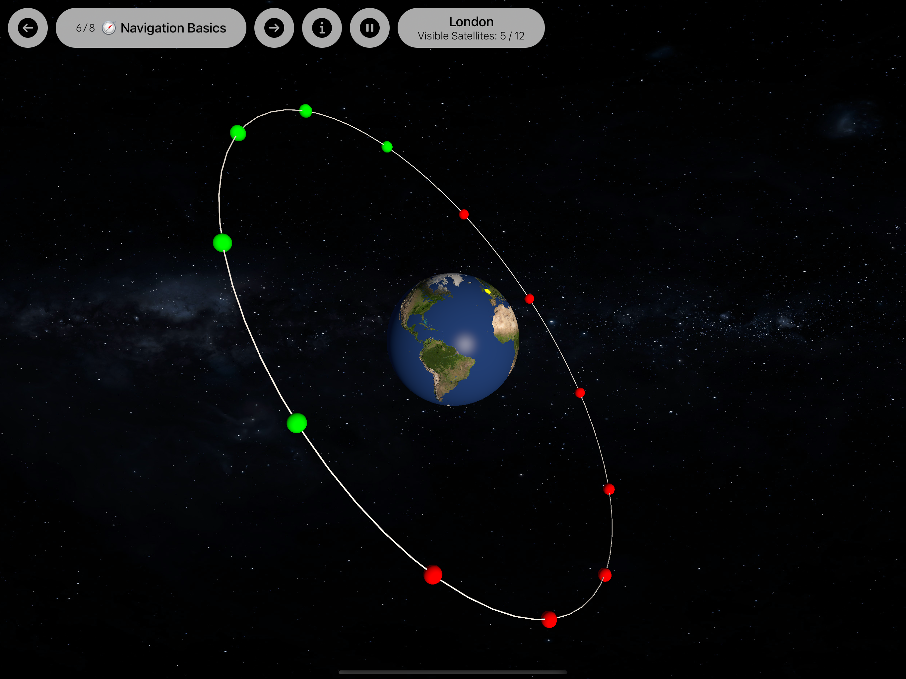

# Satellites

This app offers a **visual introduction into the topic of (navigation) satellites and their orbits**. It's my entry to the WWDC 2023 Swift Student Challenge and was only created in a weekend's time.

The app is best run on a 12.9" iPad Pro via Xcode. To run the app, it is needed  to select a development team in Xcode first.

## How It Looks

